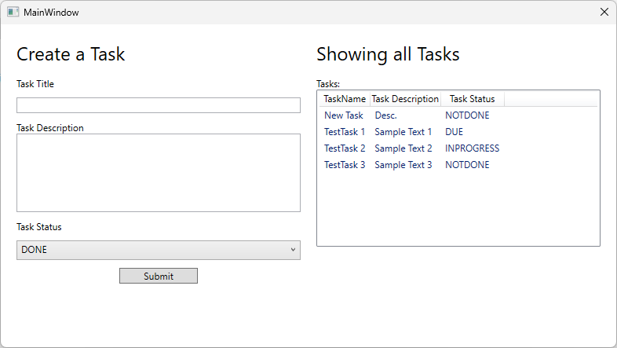
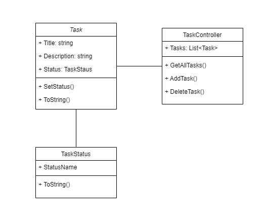

# MVVMToDoApp
A small application where I test the MVVM Application Model for C#

## What is this?
This is just a small ToDo Application I made to test out the MVVM Model. Here I will test out the different MVVM possibilities.

## The GUI
At the current state of the project, the GUI Looks like the following.

## Class Diagram
A Class Diagram created with the help of [draw.io](https://draw.io/).

## File structure
The File strucutre of the project is simple enough. Like recommended, I have a Models, ViewModels and Views folder.  
I also added a Commands and Images folder to make the separation simpler. 